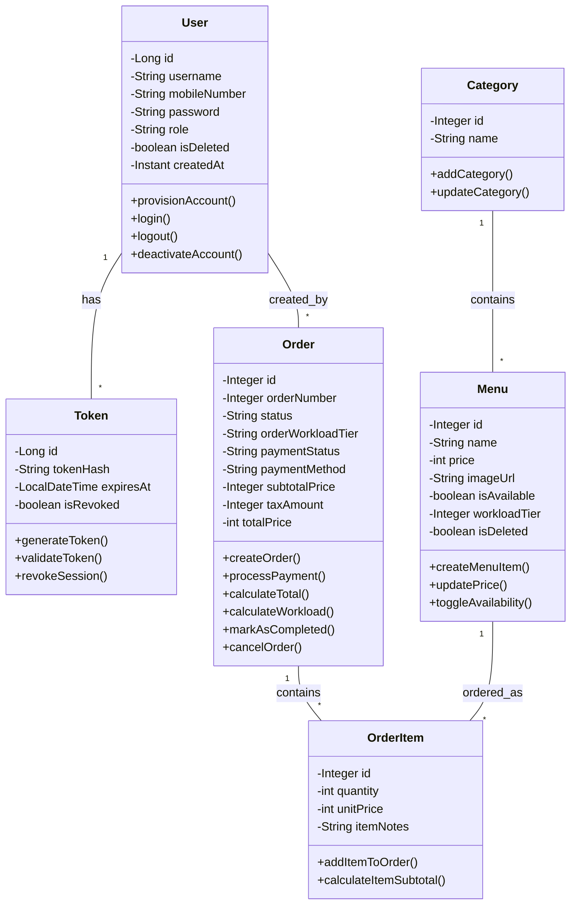

# KitchenFlow Conceptual Class Diagram

This diagram visualizes the core domain models combined with their respective service-level behaviors (methods), providing a conceptual overview of the system's capabilities.

