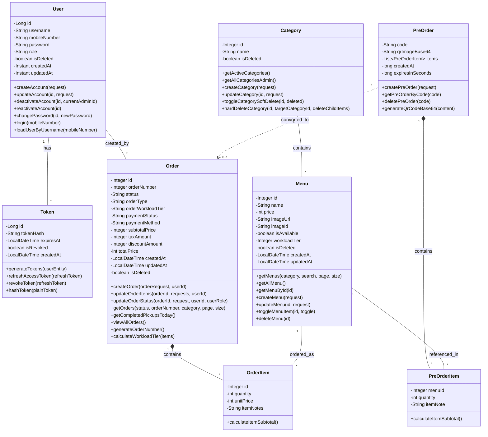

# KitchenFlow Conceptual Class Diagram

This diagram visualizes the core domain models combined with their respective service-level behaviors (methods), providing a conceptual overview of the system's capabilities. It captures both persistent entities stored in **PostgreSQL** and ephemeral pre-order draft models stored in **Redis** (supporting the in-store QR pre-order queue optimization feature). Note that guests interact with the pre-order feature anonymously and statelessly without requiring a customer account or customer session.

```mermaid
classDiagram
    class User {
        -Long id
        -String username
        -String mobileNumber
        -String password
        -String role
        -boolean isDeleted
        -Instant createdAt
        -Instant updatedAt
        +createAccount(request)
        +updateAccount(id, request)
        +deactivateAccount(id, currentAdminId)
        +reactivateAccount(id)
        +changePassword(id, newPassword)
        +login(mobileNumber)
        +loadUserByUsername(mobileNumber)
    }

    class Token {
        -Long id
        -String tokenHash
        -LocalDateTime expiresAt
        -boolean isRevoked
        -LocalDateTime createdAt
        +generateTokens(userEntity)
        +refreshAccessToken(refreshToken)
        +revokeToken(refreshToken)
        +hashToken(plainToken)
    }

    class Category {
        -Integer id
        -String name
        -boolean isDeleted
        +getActiveCategories()
        +getAllCategoriesAdmin()
        +createCategory(request)
        +updateCategory(id, request)
        +toggleCategorySoftDelete(id, deleted)
        +hardDeleteCategory(id, targetCategoryId, deleteChildItems)
    }

    class Menu {
        -Integer id
        -String name
        -int price
        -String imageUrl
        -String imageId
        -boolean isAvailable
        -Integer workloadTier
        -boolean isDeleted
        -LocalDateTime createdAt
        -LocalDateTime updatedAt
        +getMenus(category, search, page, size)
        +getAllMenu()
        +getMenuById(id)
        +createMenu(request)
        +updateMenu(id, request)
        +toggleMenuItem(id, toggle)
        +deleteMenu(id)
    }

    class Order {
        -Integer id
        -Integer orderNumber
        -String status
        -String orderType
        -String orderWorkloadTier
        -String paymentStatus
        -String paymentMethod
        -Integer subtotalPrice
        -Integer taxAmount
        -Integer discountAmount
        -int totalPrice
        -LocalDateTime createdAt
        -LocalDateTime updatedAt
        -boolean isDeleted
        +createOrder(orderRequest, userId)
        +updateOrderItems(orderId, requests, userId)
        +updateOrderStatus(orderId, request, userId, userRole)
        +getOrders(status, orderNumber, category, page, size)
        +getCompletedPickupsToday()
        +viewAllOrders()
        +generateOrderNumber()
        +calculateWorkloadTier(items)
    }

    class OrderItem {
        -Integer id
        -int quantity
        -int unitPrice
        -String itemNotes
        +calculateItemSubtotal()
    }

    class PreOrder {
        -String code
        -String qrImageBase64
        -List~PreOrderItem~ items
        -long createdAt
        -long expiresInSeconds
        +createPreOrder(request)
        +getPreOrderByCode(code)
        +deletePreOrder(code)
        +generateQrCodeBase64(content)
    }

    class PreOrderItem {
        -Integer menuId
        -int quantity
        -String itemNote
        +calculateItemSubtotal()
    }

    User "1" -- "*" Token : has
    User "1" -- "*" Order : created_by
    Category "1" -- "*" Menu : contains
    Order "1" *-- "*" OrderItem : contains
    Menu "1" -- "*" OrderItem : ordered_as
    PreOrder "1" *-- "*" PreOrderItem : contains
    Menu "1" -- "*" PreOrderItem : referenced_in
    PreOrder "1" ..> "0..1" Order : converted_to
```

### Architectural Storage Mapping

| Model / Entity | Storage Layer | Persistence Type | Lifecycle / Expiry |
| :--- | :--- | :--- | :--- |
| **`User`**, **`Token`** | PostgreSQL | Relational Database (JPA / Hibernate) | Persistent / 1-hour active refresh window |
| **`Category`**, **`Menu`** | PostgreSQL + Cloudinary | Relational Database + Media CDN | Persistent (Soft / Hard delete lifecycle) |
| **`Order`**, **`OrderItem`** | PostgreSQL | Relational Database (JPA / Hibernate) | Permanent transaction history |
| **`PreOrder`**, **`PreOrderItem`** | Redis | In-Memory Key-Value Store (`pre_order:<code>`) | Ephemeral (30-minute TTL or evicted on cashier checkout) |
