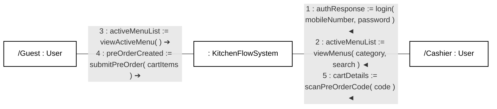
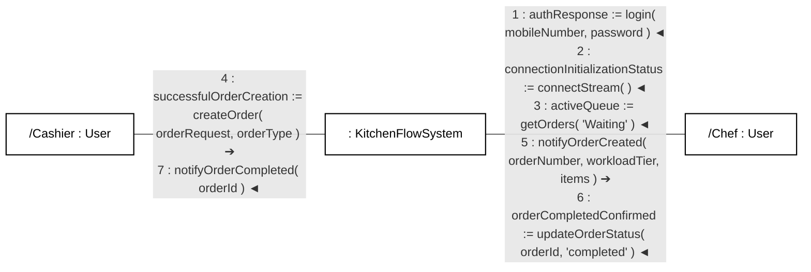
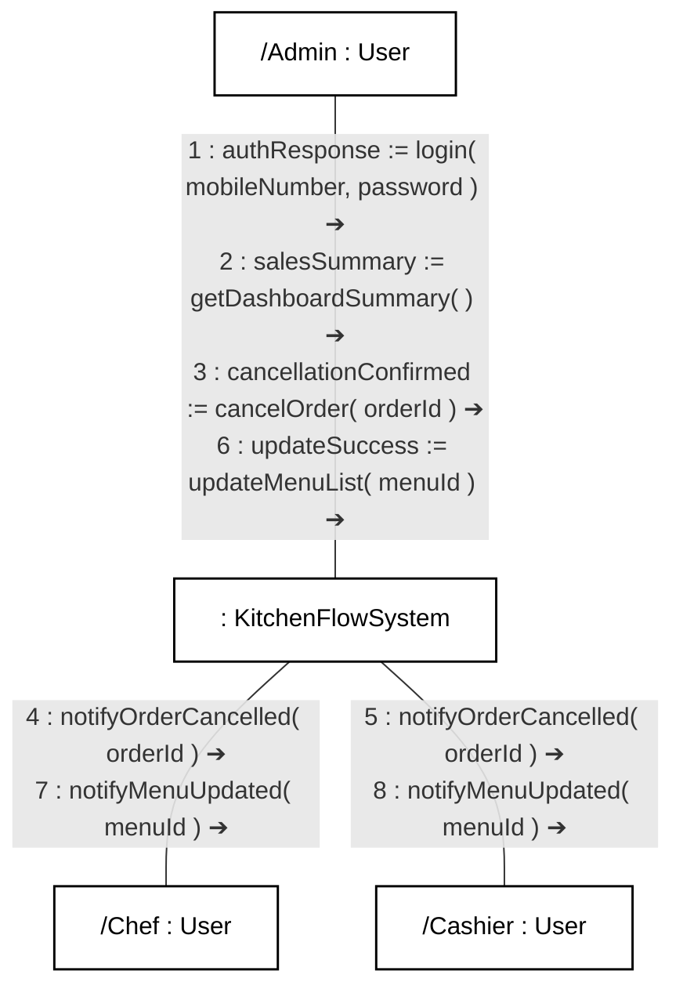

# KitchenFlow UML Collaboration Diagrams (Communication Diagrams)
*Strictly compliant with Mark Priestley’s Practical Object-Oriented Design With UML*

This document specifies the official **UML Collaboration Diagrams (Communication Diagrams)** for KitchenFlow, formulated in strict compliance with the notation and semantic rules defined in Mark Priestley’s *Practical Object-Oriented Design With UML*.

All diagrams adhere to a **flat, consecutive sequential numbering scheme (`1, 2, 3, 4, 5, 6, 7...`)**, mapping 1:1 to the chronological top-to-bottom flow of your redesigned sequence diagrams.

---

## Mark Priestley's UML Collaboration Diagram Rules Applied

1. **Classifier Roles (Participants)**:
   - Enclosed in rectangular boxes with **no underlining** (underlining is reserved only for concrete object instances, e.g. `<u>obj : Class</u>`).
   - Named roles with base class syntax: `/Guest : User`, `/Cashier : User`, `/Chef : User`, `/Admin : User`.
   - Anonymous role with base class syntax: `: KitchenFlowSystem`.

2. **Communication Pathways (Association Roles)**:
   - Connected via **plain, solid association lines** (links).
   - **No arrowheads on the association line itself** (the line represents a bidirectional communication pathway, not message direction).

3. **Message Invocation & Direction**:
   - Placed alongside the association link with a standalone directional arrow pointing to the receiving classifier role (`➔` or `◄`).

4. **Return Values via Assignment Operator (`:=`) & Flat Sequential Numbers**:
   - **No separate return arrows** and **no separate message numbers for return data**.
   - Return values are captured using the syntax:
     $$\text{sequenceNumber : returnVariable := methodName( arguments )}$$
   - Every message in the diagram is assigned a **clean, consecutive integer (`1, 2, 3, 4, 5...`)** in exact chronological order across the system.

---

## 1. Collaboration Diagram 1: Customer Pre-Order Intake Pipeline
*Maps directly to Sequence Diagram 1 (`media_1788721447802.png`)*

### Spatial Layout & Association Links:
- `/Guest : User` connected to `: KitchenFlowSystem` via a plain association link.
- `/Cashier : User` connected to `: KitchenFlowSystem` via a plain association link.

### Complete Message Sequence Table (Strictly Sequential 1 to 5):

| Seq # | Call Direction | Link Pathway | Message Specification (Priestley Syntax) | Return Variable | Description |
| :---: | :---: | :--- | :--- | :--- | :--- |
| **1** | `Cashier ➔ System` | `Cashier — System` | `1 : authResponse := login( mobileNumber, password )` | `authResponse` | Cashier authenticates and receives JWT session token. |
| **2** | `Cashier ➔ System` | `Cashier — System` | `2 : activeMenuList := viewMenus( category, search )` | `activeMenuList` | Cashier loads active menu catalog to hydrate the POS register screen. |
| **3** | `Guest ➔ System` | `Guest — System` | `3 : activeMenuList := viewActiveMenu( )` | `activeMenuList` | Customer browses current menu items from mobile browser. |
| **4** | `Guest ➔ System` | `Guest — System` | `4 : preOrderCreated := submitPreOrder( cartItems )` | `preOrderCreated` | Customer submits cart; system creates 30m draft with 6-digit PIN & QR image. |
| **5** | `Cashier ➔ System` | `Cashier — System` | `5 : cartDetails := scanPreOrderCode( code )` | `cartDetails` | Cashier scans QR code at the counter; system returns validated cart items & total. |

---

## 2. Collaboration Diagram 2: Order Placement & Kitchen Fulfillment Pipeline
*Maps directly to Sequence Diagram 2 (`media_1788721447810.png`)*

### Spatial Layout & Association Links:
- `/Cashier : User` connected to `: KitchenFlowSystem` via a plain association link.
- `/Chef : User` connected to `: KitchenFlowSystem` via a plain association link.

### Complete Message Sequence Table (Strictly Sequential 1 to 7):

| Seq # | Call Direction | Link Pathway | Message Specification (Priestley Syntax) | Return Variable | Description |
| :---: | :---: | :--- | :--- | :--- | :--- |
| **1** | `Chef ➔ System` | `Chef — System` | `1 : authResponse := login( mobileNumber, password )` | `authResponse` | Chef logs in to kitchen display tablet with credentials. |
| **2** | `Chef ➔ System` | `Chef — System` | `2 : connectionInitializationStatus := connectStream( )` | `connectionInitializationStatus` | KDS establishes persistent SSE event stream (`INIT` handshake). |
| **3** | `Chef ➔ System` | `Chef — System` | `3 : activeQueue := getOrders( "Waiting" )` | `activeQueue` | KDS hydrates active FIFO queue with 10-minute Priority thresholds. |
| **4** | `Cashier ➔ System` | `Cashier — System` | `4 : successfulOrderCreation := createOrder( orderRequest, orderType )` | `successfulOrderCreation` | Cashier confirms payment; system assigns sequential order # & Workload Tier. |
| **5** | `System ➔ Chef` | `System — Chef` | `5 : notifyOrderCreated( orderNumber, workloadTier, items )` | *None (SSE push)* | System dispatches order ticket via SSE to render card on Chef KDS screen. |
| **6** | `Chef ➔ System` | `Chef — System` | `6 : orderCompletedConfirmed := updateOrderStatus( orderId, "completed" )` | `orderCompletedConfirmed` | Chef finishes preparation and bumps card on KDS screen. |
| **7** | `System ➔ Cashier` | `System — Cashier` | `7 : notifyOrderCompleted( orderId )` | *None (SSE push)* | System broadcasts real-time SSE pickup notification to POS screen. |

---

## 3. Collaboration Diagram 3: Operational Governance & Broadcast Pipeline
*Maps directly to Sequence Diagram 3 (`media_1788721447805.png`)*

### Spatial Layout & Association Links:
- `/Admin : User` connected to `: KitchenFlowSystem` via a plain association link.
- `: KitchenFlowSystem` connected to `/Chef : User` via a plain association link.
- `: KitchenFlowSystem` connected to `/Cashier : User` via a plain association link.

### Complete Message Sequence Table (Strictly Sequential 1 to 8):

| Seq # | Call Direction | Link Pathway | Message Specification (Priestley Syntax) | Return Variable | Description |
| :---: | :---: | :--- | :--- | :--- | :--- |
| **1** | `Admin ➔ System` | `Admin — System` | `1 : authResponse := login( mobileNumber, password )` | `authResponse` | Admin/Owner authenticates with `ROLE_ADMIN` authority. |
| **2** | `Admin ➔ System` | `Admin — System` | `2 : salesSummary := getDashboardSummary( )` | `salesSummary` | Admin opens sales analytics dashboard (today's revenue, active counts). |
| **3** | `Admin ➔ System` | `Admin — System` | `3 : cancellationConfirmed := cancelOrder( orderId )` | `cancellationConfirmed` | Admin initiates emergency order cancellation. |
| **4** | `System ➔ Chef` | `System — Chef` | `4 : notifyOrderCancelled( orderId )` | *None (SSE push)* | Broadcasted by System via SSE to remove order ticket card from KDS. |
| **5** | `System ➔ Cashier` | `System — Cashier` | `5 : notifyOrderCancelled( orderId )` | *None (SSE push)* | Broadcasted by System via SSE to notify POS terminal of cancellation. |
| **6** | `Admin ➔ System` | `Admin — System` | `6 : updateSuccess := updateMenuList( menuId )` | `updateSuccess` | Admin toggles dish availability (e.g., marks sold out or restocked). |
| **7** | `System ➔ Chef` | `System — Chef` | `7 : notifyMenuUpdated( menuId )` | *None (SSE push)* | Broadcasted by System via SSE to update menu item status on KDS. |
| **8** | `System ➔ Cashier` | `System — Cashier` | `8 : notifyMenuUpdated( menuId )` | *None (SSE push)* | Broadcasted by System via SSE to update menu item status on POS. |

---

## Guidelines for Drawing in draw.io (Priestley Standard)

When replicating or drawing these diagrams in [draw.io](https://app.diagrams.net):
1. **Objects / Roles**: Use standard UML Classifier rectangle shapes (`shape=rectangle;whiteSpace=wrap;html=1;fillColor=#ffffff;strokeColor=#000000;`). Ensure the role text is **not underlined** (e.g. `/Guest : User`, `: KitchenFlowSystem`).
2. **Communication Pathways**: Draw a **plain, solid line** between the shapes (`endArrow=none;strokeColor=#000000;`). Never add arrowheads to the line itself.
3. **Messages and Arrows**:
   - Place a text label alongside the link containing the Priestley assignment expression:
     `sequenceNumber : returnVariable := methodName( arguments )`
   - Beside or beneath each text label, place a **small standalone directional arrow** (`endArrow=open;strokeColor=#000000;`) pointing toward the receiving role box.
4. **Consecutive Ordering**: Every message simply follows the clean integer sequence (`1, 2, 3, 4, 5, 6, 7, 8...`) matching the chronological order of execution.
