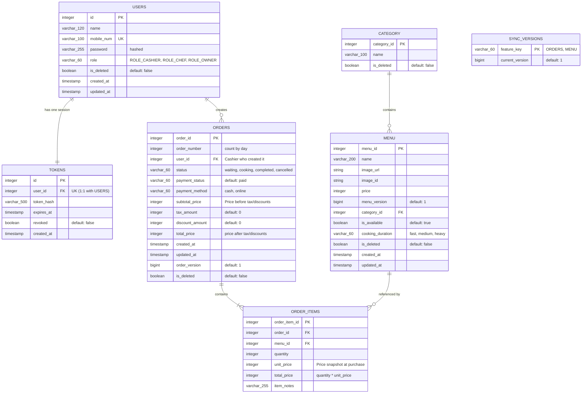

# POS + KDS Database Design

This document details the database schema designed for the Point of Sale (POS) and Kitchen Display System (KDS). The design focuses on a streamlined, automated workflow between the Cashier and Kitchen Staff (Chef) without requiring a manual Manager role.

---

## Entity Relationship Diagram

---

## Tables Dictionary

### 1. `USERS`
Stores credentials and roles for authentication and authorization. Registration is disabled for cashiers and chefs; accounts are managed/seeded.

| Column Name | Type | Key | Description |
| :--- | :--- | :--- | :--- |
| `id` | `INTEGER` | PK | Unique identifier for the user. |
| `name` | `VARCHAR(120)` | | Full name of the user. |
| `mobile_num` | `VARCHAR(100)` | Unique | Mobile number used for login. |
| `password` | `VARCHAR(255)` | | Cryptographically hashed password. |
| `role` | `VARCHAR(60)` | | Security role: `ROLE_CASHIER`, `ROLE_CHEF`, `ROLE_OWNER`. |
| `is_deleted` | `BOOLEAN` | | Soft delete flag (default: `false`). |
| `created_at` | `TIMESTAMP` | | When the user was created. |
| `updated_at` | `TIMESTAMP` | | When the user was last updated. |

### 2. `TOKENS`
Tracks JWT token hashes for revocation and expiration checking. The database enforces a `1:1` relationship with `USERS` to support single-device logins only.

| Column Name | Type | Key | Description |
| :--- | :--- | :--- | :--- |
| `id` | `INTEGER` | PK | Unique identifier for the token. |
| `user_id` | `INTEGER` | FK, Unique | References `USERS(id)`. Enforces single-device session. |
| `token_hash` | `VARCHAR(500)` | | Cryptographic hash of the token. |
| `expires_at` | `TIMESTAMP` | | Expiration timestamp of the token. |
| `revoked` | `BOOLEAN` | | Revocation toggle (default: `false`). |
| `created_at` | `TIMESTAMP` | | Timestamp when the token was issued. |

### 3. `CATEGORY`
Maintains menu categories (e.g., Drinks, Mains, Desserts).

| Column Name | Type | Key | Description |
| :--- | :--- | :--- | :--- |
| `category_id` | `INTEGER` | PK | Unique identifier for the category. |
| `name` | `VARCHAR(100)` | | Display name of the category. |
| `is_deleted` | `BOOLEAN` | | Soft delete flag (default: `false`). |

### 4. `MENU`
Stores the master food and beverage menu items.

| Column Name | Type | Key | Description |
| :--- | :--- | :--- | :--- |
| `menu_id` | `INTEGER` | PK | Unique identifier for the menu item. |
| `name` | `VARCHAR(200)` | | Display name of the food/drink item. |
| `image_url` | `VARCHAR(500)` | | Remote URL path to the item's image asset. |
| `image_id` | `VARCHAR(255)` | | Associated ID for the image asset in storage. |
| `price` | `INTEGER` | | Active price of the item. |
| `menu_version`| `BIGINT` | | Version tag for optimistic locking and Delta Sync (default: `1`). |
| `category_id` | `INTEGER` | FK | References `CATEGORY(category_id)`. |
| `is_available`| `BOOLEAN` | | Availability toggle (default: `true`). Chef switches this to `false` in KDS when sold out. |
| `cooking_duration`| `VARCHAR(60)` | | Preparation duration tier: `fast`, `medium`, `heavy`. |
| `is_deleted` | `BOOLEAN` | | Soft delete flag (default: `false`). |
| `created_at` | `TIMESTAMP` | | Date and time the menu item was created. |
| `updated_at` | `TIMESTAMP` | | Date and time the menu item was last updated. |

### 5. `ORDERS`
Represents customer tickets created by Cashiers. Status is tracked globally at the order level.

| Column Name | Type | Key | Description |
| :--- | :--- | :--- | :--- |
| `order_id` | `INTEGER` | PK | Unique identifier for the order ticket. |
| `order_number`| `INTEGER` | | Dynamic order number for the day (e.g. KF-001, KF-002, counting by day). |
| `user_id` | `INTEGER` | FK | References `USERS(id)` (Cashier who placed the order). |
| `status` | `VARCHAR(60)` | | Preparation state: `waiting`, `cooking`, `completed`, `cancelled`. |
| `payment_status`| `VARCHAR(60)`| | Payment state: `unpaid`, `paid` (default: `paid`). |
| `payment_method`| `VARCHAR(60)`| | Payment type: `cash`, `online`. |
| `subtotal_price`| `INTEGER` | | Overall order subtotal (before tax/discounts). |
| `tax_amount` | `INTEGER` | | Calculated tax amount for Owner Tax Reports (default: `0`). |
| `discount_amount`| `INTEGER`| | Calculated discount amount (default: `0`). |
| `total_price` | `INTEGER` | | Overall order total (after tax/discounts). |
| `created_at` | `TIMESTAMP` | | When the cashier created the order. |
| `updated_at` | `TIMESTAMP` | | Timestamp of the latest change to the order. |
| `order_version`| `BIGINT` | | Version tag for optimistic locking and Delta Sync (default: `1`). |
| `is_deleted` | `BOOLEAN` | | Soft delete flag (default: `false`). |

### 6. `SYNC_VERSIONS`
Keeps track of the latest version for entities to support Delta Sync workflows.

| Column Name | Type | Key | Description |
| :--- | :--- | :--- | :--- |
| `feature_key` | `VARCHAR(60)` | PK | The feature module identifier (e.g. `ORDERS`, `MENU`). |
| `current_version`| `BIGINT` | | The latest global version/sequence number for this feature (default: `1`). |

### 7. `ORDER_ITEMS`
Contains the specific items purchased within an order.

| Column Name | Type | Key | Description |
| :--- | :--- | :--- | :--- |
| `order_item_id`| `INTEGER` | PK | Unique identifier for the line item. |
| `order_id` | `INTEGER` | FK | References `ORDERS(order_id)`. |
| `menu_id` | `INTEGER` | FK | References `MENU(menu_id)`. |
| `quantity` | `INTEGER` | | Number of units ordered. |
| `unit_price` | `INTEGER` | | **Price snapshot** at purchase time. Prevents historical audit updates. |
| `total_price` | `INTEGER` | | Subtotal for this line item (`quantity * unit_price`). |
| `item_notes` | `VARCHAR(255)`| | Prep/special instructions for this item. |

---

## Design Rationale

1. **Price Snapshotting:** By copying `unit_price` into `ORDER_ITEMS` at purchase time, we ensure historical reports remain correct if menu prices are updated or items are deleted in the `MENU` table.
2. **Global Order Status:** Keeping preparation status (`waiting`, `cooking`, `completed`, `cancelled`) at the `ORDERS` level ensures the Chef can manage orders as whole "tickets" on the KDS screen, significantly simplifying KDS state management.
3. **Single-Device Restriction:** Enforcing a `Unique` constraint on `TOKENS(user_id)` ensures that when a user logs in on a new device, any older token is invalidated, maintaining a strict 1-session-per-user policy.
4. **Delta Sync & locking:** Incorporating `menu_version` and `order_version` along with a centralized `SYNC_VERSIONS` registry provides a robust pattern for conflict-free local caching and offline-first delta sync.
5. **No-Register Roles:** Security is handled via pre-seeding. Cashiers and chefs cannot sign themselves up; they only log in using credentials created by the Owner.
