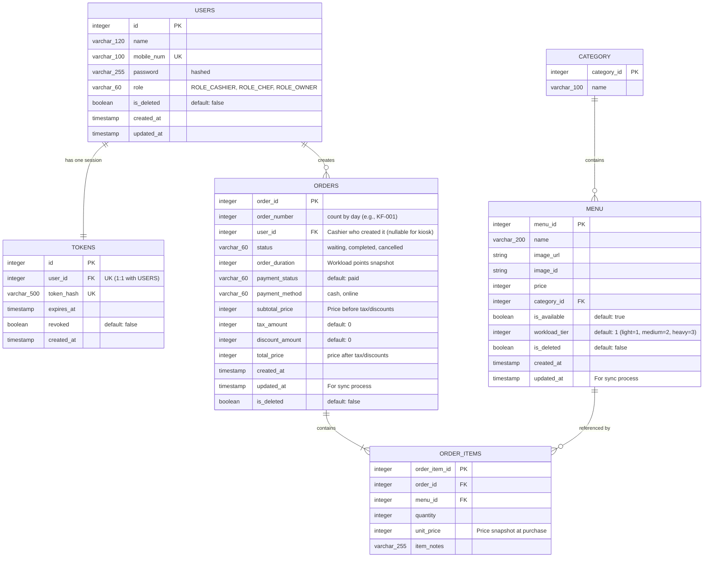

# POS + KDS Database Design

This document details the database schema designed for the Point of Sale (POS) and Kitchen Display System (KDS). The design focuses on a streamlined, automated workflow for a **Self-Service Store**, minimizing friction between the Cashier, Kitchen Staff (Chef), and Owner.

---

## Entity Relationship Diagram

---

## Tables Dictionary

### 1. `USERS`
Stores credentials and roles for authentication and authorization. Registration is disabled for cashiers and chefs; accounts are managed/seeded.

| Column Name | Type | Key | Description |
| :--- | :--- | :--- | :--- |
| `id` | `INTEGER` | PK | Unique identifier for the user. |
| `name` | `VARCHAR(120)` | | Full name of the user. |
| `mobile_num` | `VARCHAR(100)` | Unique | Mobile number used for login. |
| `password` | `VARCHAR(255)` | | Cryptographically hashed password. |
| `role` | `VARCHAR(60)` | | Security role: `ROLE_CASHIER`, `ROLE_CHEF`, `ROLE_OWNER`. |
| `is_deleted` | `BOOLEAN` | | Soft delete flag (default: `false`). |
| `created_at` | `TIMESTAMP` | | When the user was created. |
| `updated_at` | `TIMESTAMP` | | When the user was last updated. |

### 2. `TOKENS`
Tracks JWT token hashes for revocation and expiration checking. The database enforces a `1:1` relationship with `USERS` to support single-device logins only.

| Column Name | Type | Key | Description |
| :--- | :--- | :--- | :--- |
| `id` | `INTEGER` | PK | Unique identifier for the token. |
| `user_id` | `INTEGER` | FK, Unique | References `USERS(id)`. Enforces single-device session. |
| `token_hash` | `VARCHAR(500)` | Unique | Cryptographic hash of the token. |
| `expires_at` | `TIMESTAMP` | | Expiration timestamp of the token. |
| `revoked` | `BOOLEAN` | | Revocation toggle (default: `false`). |
| `created_at` | `TIMESTAMP` | | Timestamp when the token was issued. |

### 3. `CATEGORY`
Maintains menu categories (e.g., Drinks, Mains, Desserts). Deleting a category sets the corresponding `menu` items' `category_id` to null (no soft deletes needed here).

| Column Name | Type | Key | Description |
| :--- | :--- | :--- | :--- |
| `category_id` | `INTEGER` | PK | Unique identifier for the category. |
| `name` | `VARCHAR(100)` | | Display name of the category. |

### 4. `MENU`
Stores the master food and beverage menu items.

| Column Name | Type | Key | Description |
| :--- | :--- | :--- | :--- |
| `menu_id` | `INTEGER` | PK | Unique identifier for the menu item. |
| `name` | `VARCHAR(200)` | | Display name of the food/drink item. |
| `image_url` | `VARCHAR(500)` | | Remote URL path to the item's image asset. |
| `image_id` | `VARCHAR(255)` | | Associated ID for the image asset in storage. |
| `price` | `INTEGER` | | Active price of the item. |
| `category_id` | `INTEGER` | FK | References `CATEGORY(category_id)`. |
| `is_available`| `BOOLEAN` | | Availability toggle (default: `true`). Managed exclusively by Owner. |
| `workload_tier`| `INTEGER` | | Complexity rating: `1` (light), `2` (medium), `3` (heavy). |
| `is_deleted` | `BOOLEAN` | | Soft delete flag (default: `false`). |
| `created_at` | `TIMESTAMP` | | Date and time the menu item was created. |
| `updated_at` | `TIMESTAMP` | | Date and time the menu item was last updated. Used for Sync logic. |

### 5. `ORDERS`
Represents pre-paid customer tickets in a self-service model.

| Column Name | Type | Key | Description |
| :--- | :--- | :--- | :--- |
| `order_id` | `INTEGER` | PK | Unique identifier for the order ticket. |
| `order_number`| `INTEGER` | | Dynamic order number for the day (e.g., counting by day). |
| `user_id` | `INTEGER` | FK | References `USERS(id)` (Cashier who placed the order; Nullable for self-serve kiosks). |
| `status` | `VARCHAR(60)` | | Preparation state: `waiting`, `completed`, `cancelled`. |
| `order_duration`| `INTEGER` | | Snapshot of calculated workload tier (`Total Points = sum(Q * W)`). |
| `payment_status`| `VARCHAR(60)`| | Payment state: `unpaid`, `paid` (default: `paid`). |
| `payment_method`| `VARCHAR(60)`| | Payment type: `cash`, `online` (default: `cash`). |
| `subtotal_price`| `INTEGER` | | Overall order subtotal (before tax/discounts). |
| `tax_amount` | `INTEGER` | | Calculated tax amount for Owner Tax Reports (default: `0`). |
| `discount_amount`| `INTEGER`| | Calculated discount amount (default: `0`). |
| `total_price` | `INTEGER` | | Overall order total (after tax/discounts). |
| `created_at` | `TIMESTAMP` | | When the cashier created the order. |
| `updated_at` | `TIMESTAMP` | | Timestamp of the latest change to the order. Used for Sync logic. |
| `is_deleted` | `BOOLEAN` | | Soft delete flag (default: `false`). |

### 6. `ORDER_ITEMS`
Contains the specific items purchased within an order. Line totals are derived dynamically (`quantity * unit_price`).

| Column Name | Type | Key | Description |
| :--- | :--- | :--- | :--- |
| `order_item_id`| `INTEGER` | PK | Unique identifier for the line item. |
| `order_id` | `INTEGER` | FK | References `ORDERS(order_id)`. |
| `menu_id` | `INTEGER` | FK | References `MENU(menu_id)`. |
| `quantity` | `INTEGER` | | Number of units ordered. |
| `unit_price` | `INTEGER` | | **Price snapshot** at purchase time. Prevents historical audit updates. |
| `item_notes` | `VARCHAR(255)`| | Prep/special instructions for this item. |

---

## Design Rationale & Business Controls

1. **Pre-Paid Self-Service Operations:** Orders are strictly created upfront with `payment_status = 'paid'`. There is no `cooking` state. Kitchen staff utilize a highly efficient single-touch workflow, advancing an order from `waiting` directly to `completed`.
2. **Workload Point Calculation:** To give chefs immediate visibility into order complexity without reading item-by-item, `ORDERS.order_duration` stores an algorithmic snapshot calculated as `sum(quantity * workload_tier)`. Ranges translate to:
   * **Light:** 0-3 points
   * **Medium:** 4-6 points
   * **Heavy:** 7+ points
3. **Owner-Exclusive Permissions (Fraud & Shirking Controls):**
   * **Menu Availability:** Only the Owner can toggle a menu item to "unavailable". This prevents "shirking" where lazy kitchen staff disable heavy menu items.
   * **Cancellations:** Only the Owner can cancel a paid order. This prevents cashier-chef collusion to cancel paid tickets and pocket cash.
4. **Physical Out-of-Stock Resolution:** If the kitchen physically runs out of an ingredient before the Owner updates the menu, a customer might place a pre-paid order. The Chef alerts the Owner, the Owner marks the order `cancelled`, and the Cashier is automatically notified to initiate a customer refund/replacement.
5. **Timestamp-Based Delta Sync:** Removed version columns (`menu_version`, `order_version`) in favor of utilizing the standard `updated_at` timestamps for pushing real-time cache invalidations and syncing delta updates across clients.
