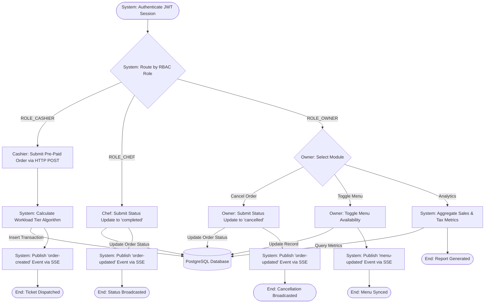

# KitchenFlow System Architecture Flow

This flowchart represents the backend **System Flow**, mapping how the server processes data based on the three explicit roles. It encompasses the full intended design from `features.md`, including SSE synchronization for all required modules.

