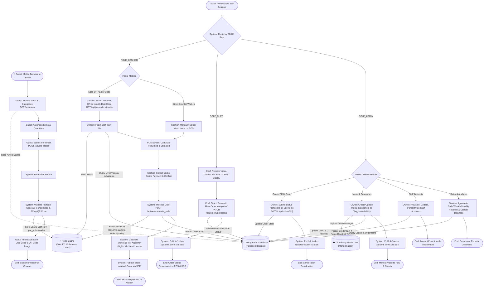

# KitchenFlow System Architecture Flow

This flowchart represents the comprehensive **System Flow** of KitchenFlow. It models both the **unauthenticated customer/guest mobile pre-order pipeline** and the **authenticated role-based staff pipelines** (`ROLE_CASHIER`, `ROLE_CHEF`, `ROLE_ADMIN`), detailing interactions across **PostgreSQL**, **Redis (30m TTL)**, **Cloudinary**, and the **Real-Time SSE Engine**.

```mermaid
graph TD
    %% Storage Layers
    DB[("🐘 PostgreSQL Database<br/>(Persistent Storage)")]
    Redis[("⚡ Redis Cache<br/>(30m TTL Ephemeral Drafts)")]
    CDN[("☁️ Cloudinary Media CDN<br/>(Menu Images)")]

    %% -------------------------------------------------------------
    %% 1. Unauthenticated Customer / Guest Pre-Order Pipeline
    %% -------------------------------------------------------------
    GuestStart(["📱 Guest: Mobile Browser in Queue"]) --> GuestBrowse["Guest: Browse Menu & Categories<br/>GET /api/menu"]
    GuestBrowse -.->|"Read Active Dishes"| DB
    GuestBrowse --> GuestSelect["Guest: Assemble Items & Quantities"]
    GuestSelect --> GuestSubmit["Guest: Submit Pre-Order<br/>POST /api/pre-orders"]
    
    GuestSubmit --> SysPreOrder["System: Pre-Order Service"]
    SysPreOrder --> SysQR["System: Validate Payload, Generate 6-Digit Code & ZXing QR Code"]
    SysQR -->|"Store JSON Draft key: pre_order:{code}"| Redis
    SysQR --> GuestDisplay["Guest Phone: Display 6-Digit Code & QR Code Image"]
    GuestDisplay --> EndGuest(["End: Customer Ready at Counter"])

    %% -------------------------------------------------------------
    %% 2. Staff Authentication & RBAC Routing
    %% -------------------------------------------------------------
    Auth(["🔐 Staff: Authenticate JWT Session"]) --> Router{"System: Route by RBAC Role"}

    %% -------------------------------------------------------------
    %% 3. Cashier System Pipeline (ROLE_CASHIER / ROLE_ADMIN)
    %% -------------------------------------------------------------
    Router -- "ROLE_CASHIER" --> CashierChoice{"Intake Method"}
    
    CashierChoice -- "Scan QR / Enter Code" --> CashierScan["Cashier: Scan Customer QR or Input 6-Digit Code<br/>GET /api/pre-orders/{code}"]
    CashierScan --> PullDraft["System: Fetch Draft Item IDs"]
    PullDraft -->|"Read JSON"| Redis
    PullDraft -->|"Query Live Prices & isAvailable"| DB
    PullDraft --> AutoCart["POS Screen: Cart Auto-Populated & Validated"]

    CashierChoice -- "Direct Counter Walk-in" --> ManualCart["Cashier: Manually Select Menu Items on POS"]
    ManualCart --> AutoCart

    AutoCart --> CashierPay["Cashier: Collect Cash / Online Payment & Confirm"]
    CashierPay --> SubmitOrder["System: Process Order<br/>POST /api/orders/create_order"]
    SubmitOrder -->|"Evict Used Draft<br/>DELETE /api/pre-orders/{code}"| Redis
    SubmitOrder -->|"Persist Order & OrderItems"| DB
    SubmitOrder --> SysCalc["System: Calculate Workload Tier Algorithm<br/>(Light / Medium / Heavy)"]
    SysCalc --> SSE1["System: Publish 'order-created' Event via SSE"]
    SSE1 --> EndPOS(["End: Ticket Dispatched to Kitchen"])

    %% -------------------------------------------------------------
    %% 4. Chef System Pipeline (ROLE_CHEF)
    %% -------------------------------------------------------------
    Router -- "ROLE_CHEF" --> KDS["Chef: Receive 'order-created' via SSE on KDS Display"]
    KDS --> ChefComplete["Chef: Touch Screen to Mark Order 'completed'<br/>PATCH /api/orders/{id}/status"]
    ChefComplete -->|"Validate Items & Update Status"| DB
    ChefComplete --> SSE2["System: Publish 'order-updated' Event via SSE"]
    SSE2 --> EndKDS(["End: Order Status Broadcasted to POS & KDS"])

    %% -------------------------------------------------------------
    %% 5. Owner / Admin System Pipeline (ROLE_ADMIN)
    %% -------------------------------------------------------------
    Router -- "ROLE_ADMIN" --> AdminRouter{"Owner: Select Module"}

    %% Admin: Order Management
    AdminRouter -- "Cancel / Edit Order" --> OwnerCancel["Owner: Submit Status 'cancelled' or Edit Items<br/>PATCH /api/orders/{id}"]
    OwnerCancel -->|"Update Order State"| DB
    OwnerCancel --> SSE3["System: Publish 'order-updated' Event via SSE"]
    SSE3 --> EndCancel(["End: Cancellation Broadcasted"])

    %% Admin: Menu & Category Management
    AdminRouter -- "Menu & Categories" --> SysMenu["Owner: Create/Update Menu, Categories, or Toggle Availability"]
    SysMenu -->|"Upload / Delete Images"| CDN
    SysMenu -->|"Update Menu & Category Records"| DB
    SysMenu --> SSE4["System: Publish 'menu-updated' Event via SSE"]
    SSE4 --> EndMenu(["End: Menu Synced to POS & Guests"])

    %% Admin: Account Management
    AdminRouter -- "Staff Accounts" --> SysAccount["Owner: Provision, Update, or Deactivate Staff Accounts"]
    SysAccount -->|"Persist Credentials & Purge Revoked Tokens"| DB
    SysAccount --> EndAccount(["End: Account Provisioned / Deactivated"])

    %% Admin: Sales Analytics & Reporting
    AdminRouter -- "Sales & Analytics" --> SysReport["System: Aggregate Daily/Weekly/Monthly Revenue & Cashier Balances"]
    SysReport -->|"Query Orders & OrderItems"| DB
    SysReport --> EndReport(["End: Dashboard Reports Generated"])
```

### Flow Architecture Highlights

1. **Dual Storage Coordination**:
   - **PostgreSQL**: Manages permanent transactions, historical records, staff credentials, categories, and master menu items.
   - **Redis**: Acts as a high-speed buffer for high-traffic peak hour pre-orders, isolating temporary cart traffic from the primary database with an automated 30-minute expiration (`TTL = 1800s`).
   - **Cloudinary**: Handles high-performance CDN image storage and transformation for food item assets.

2. **Decoupled Lifecycle of Pre-Orders**:
   - Pre-orders exist only in Redis until scanned and paid at the counter.
   - Upon successful payment (`POST /api/orders/create_order`), the Redis pre-order key is immediately evicted (`DELETE /api/pre-orders/{code}`), preventing token reuse or stale cart checkout.

3. **Event-Driven Push Sync (SSE)**:
   - Real-time events (`order-created`, `order-updated`, `menu-updated`) are dispatched asynchronously via `EventEmitterService`, maintaining sub-500ms sync across POS terminals, KDS screens, and administrative dashboards.

