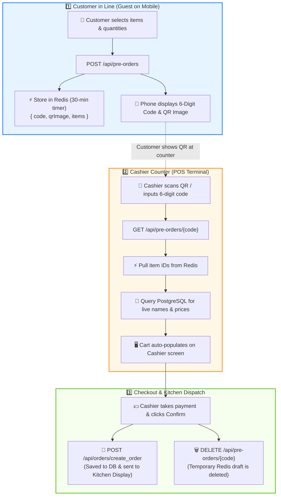

# 📱 In-Store QR Pre-Order & Queue Optimization Feature

## Overview

The **In-Store QR Pre-Order System** streamlines the counter ordering experience during peak operational hours. Customers waiting in line browse the menu on their mobile devices, select items, and generate a temporary **6-digit code and QR code**. When reaching the counter, the cashier scans the QR code or enters the 6-digit code, instantly loading the cart on the POS screen for payment collection and dispatch to the Kitchen Display System (KDS).

---

## 🏗️ Architecture & Workflow



```
1. Customer Mobile Browser (Guest in Line)
   └── POST /api/pre-orders (Public)
       ├── Payload: [{ menuId: 1, quantity: 2, itemNote: "Less sugar" }]
       ├── Validates payload (non-empty, quantity >= 1)
       ├── Generates 6-digit numeric code (e.g. "849201")
       ├── Saves pure JSON to Redis under key `pre_order:849201` (TTL: 30 minutes)
       ├── Generates 300x300 PNG QR Code via ZXing
       └── Returns: { code: "849201", qrImageBase64: "data:image/png;base64,...", expiresInSeconds: 1800 }

2. Cashier Counter (POS Terminal)
   └── Cashier scans QR / inputs code: "849201"
   └── GET /api/pre-orders/849201 (ROLE_CASHIER / ROLE_ADMIN)
       ├── 1. Reads lightweight item IDs from Redis key `pre_order:849201`
       ├── 2. Queries PostgreSQL: `menuRepo.findAllById(menuIds)`
       ├── 3. Validates real-time item availability (`isAvailable = true`) and price accuracy
       ├── 4. Calculates subtotal, tax (5%), and total
       └── 5. Returns full Order Cart payload to Cashier screen

3. Checkout & Token Eviction
   └── Cashier collects payment & confirms -> POST /api/orders/create_order
   └── DELETE /api/pre-orders/849201 -> Evicts temporary draft from Redis
```

---

## ⚡ Redis In-Memory Storage Design

* **Key Schema**: `pre_order:<6-digit-code>` (e.g., `pre_order:849201`)
* **TTL (Time-To-Live)**: 1,800 seconds (30 minutes)
* **Value Format**: Pure, human-readable UTF-8 standard JSON:
  ```json
  {
    "code": "849201",
    "qrImageBase64": "data:image/png;base64,iVBORw0KGgoAAAANSUhEUgAAASwAAAEsCAYAAAB55达...",
    "items": [
      { "menuId": 1, "quantity": 2, "itemNote": "Less sugar" },
      { "menuId": 2, "quantity": 1, "itemNote": "Warm" }
    ],
    "createdAt": 1787140129065
  }
  ```

---

## 🔌 API Endpoints Specification

### 1. Create Pre-Order (Guest Mobile)
* **Method**: `POST`
* **Path**: `/api/pre-orders`
* **Access**: Public / Unauthenticated (`permitAll`)
* **Request Body**:
  ```json
  {
    "items": [
      {
        "menuId": 1,
        "quantity": 2,
        "itemNote": "Less sugar"
      },
      {
        "menuId": 2,
        "quantity": 1,
        "itemNote": null
      }
    ]
  }
  ```
* **Response (`201 Created`)**:
  ```json
  {
    "code": "849201",
    "qrImageBase64": "data:image/png;base64,iVBORw0KGgoAAAANSUhEUgAAASwAAAEsCAYAAAB55达...",
    "expiresInSeconds": 1800
  }
  ```

---

### 2. Fetch Pre-Order by Code (Cashier Scan)
* **Method**: `GET`
* **Path**: `/api/pre-orders/{code}`
* **Access**: Protected (`ROLE_CASHIER`, `ROLE_ADMIN`)
* **Response (`200 OK`)**:
  ```json
  {
    "code": "849201",
    "items": [
      {
        "menuId": 1,
        "menuName": "Iced Americano",
        "price": 3000,
        "imageUrl": "https://cloudinary.com/.../americano.jpg",
        "quantity": 2,
        "itemNote": "Less sugar",
        "subtotal": 6000,
        "isAvailable": true
      },
      {
        "menuId": 2,
        "menuName": "Croissant",
        "price": 2500,
        "imageUrl": "https://cloudinary.com/.../croissant.jpg",
        "quantity": 1,
        "itemNote": null,
        "subtotal": 2500,
        "isAvailable": true
      }
    ],
    "subtotalPrice": 8500,
    "taxAmount": 425,
    "totalPrice": 8925,
    "allItemsAvailable": true
  }
  ```
* **Response (`404 Not Found`)**:
  ```json
  {
    "error": "Pre-order with code 849201 not found or has expired"
  }
  ```

---

### 3. Delete Pre-Order Token
* **Method**: `DELETE`
* **Path**: `/api/pre-orders/{code}`
* **Access**: Protected (`ROLE_CASHIER`, `ROLE_ADMIN`)
* **Response (`200 OK`)**:
  ```json
  {
    "message": "Pre-order draft deleted successfully"
  }
  ```

---

## 🛡️ Error Handling Conventions

All endpoints across the KitchenFlow API strictly return error payloads with the standardized JSON structure:
```json
{
  "error": "<Descriptive error message>"
}
```

* **Availability Check Example**:
  When an item is unavailable during order creation:
  ```json
  {
    "error": "Iced Americano is not available"
  }
  ```

---

## 🧪 Verification & Testing

Unit tests for the pre-order workflow are located in `PreOrderServiceTest.java`:
```powershell
.\mvnw.cmd test "-Dtest=PreOrderServiceTest"
```

Tests cover:
1. `createPreOrder_ShouldStoreCleanJsonInRedisAndReturnBase64QrCode`
2. `getPreOrderByCode_WhenExists_ShouldQueryPostgresAndReturnDetails`
3. `getPreOrderByCode_WhenItemUnavailable_ShouldFlagAllItemsAvailableFalse`
4. `getPreOrderByCode_WhenNotFoundInRedis_ShouldThrowPreOrderNotFoundException`
5. `deletePreOrder_ShouldCallRedisDelete`
