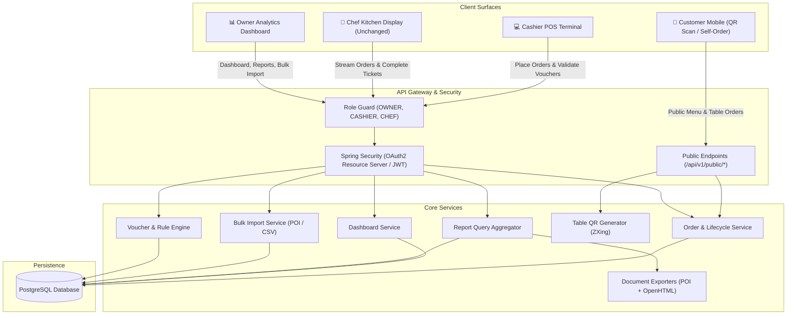
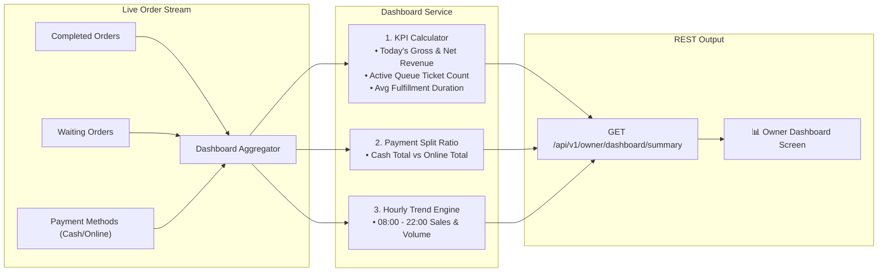
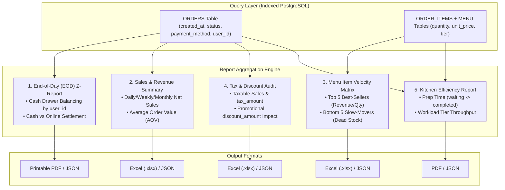
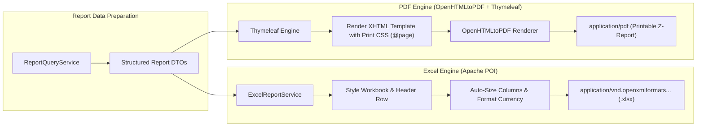
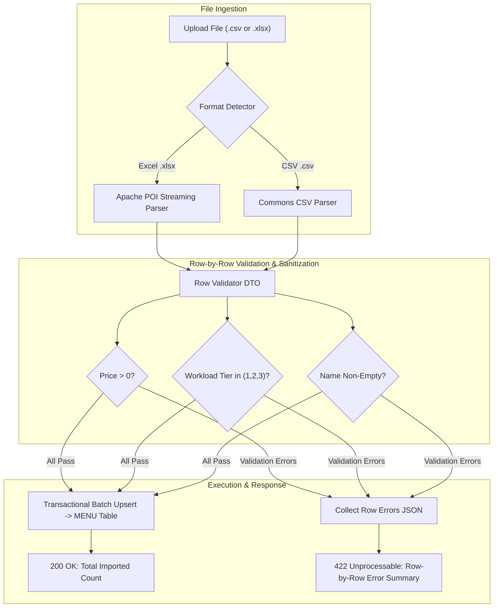
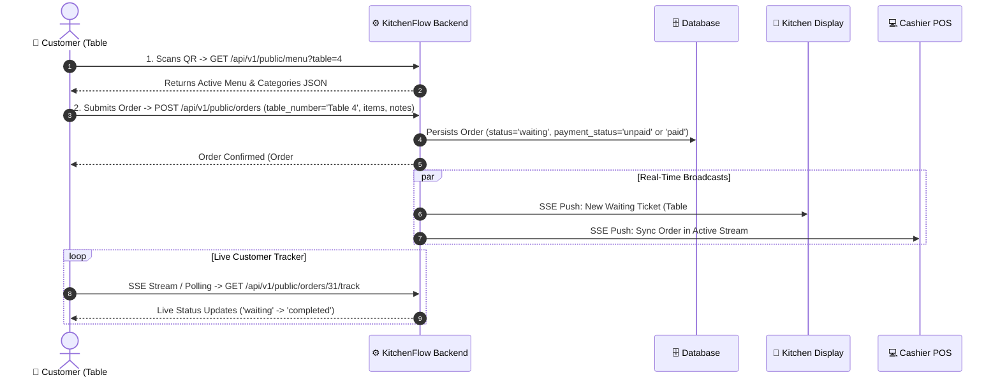
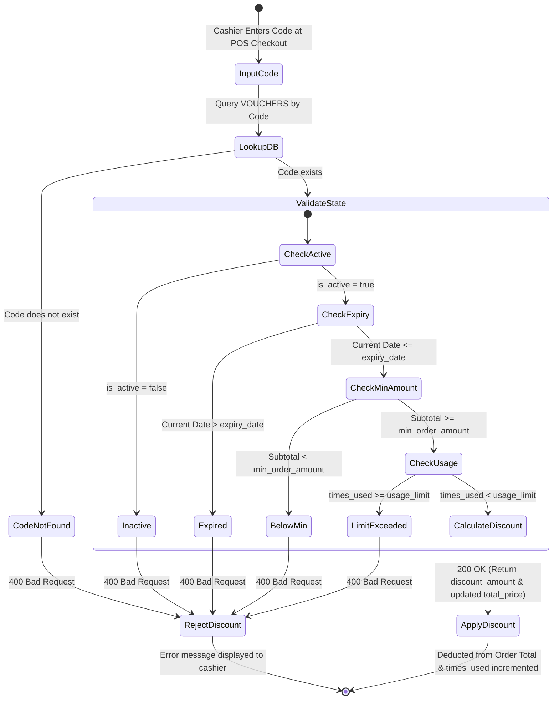

# KitchenFlow: Backend Implementation Plan & Feature Architecture

> **Location:** `backend/poskds/IMPLEMENTATION_PLAN.md`  
> **Status:** Planning Phase (No implementation changes executed)  
> **Scope:** Owner Dashboard, 5 Core Business Reports, Data Import/Export (Excel/PDF), QR Table Customer Self-Ordering, and Voucher Management Engine. *(Note: KDS module remains untouched as per existing active implementation).*

---

## 📑 Table of Contents
1. [System Overview & Module Map](#1-system-overview--module-map)
2. [Feature 1: Live Dashboard Module](#2-feature-1-live-dashboard-module)
3. [Feature 2: Business Intelligence & The 5 Core Reports](#3-feature-2-business-intelligence--the-5-core-reports)
4. [Feature 3: Multi-Format Data Export Engine (Excel & PDF)](#4-feature-3-multi-format-data-export-engine-excel--pdf)
5. [Feature 4: Bulk Menu Data Import Engine (CSV / Excel → Database)](#5-feature-4-bulk-menu-data-import-engine-csv--excel--database)
6. [Feature 5: QR Code Table Generation & Customer Self-Ordering](#6-feature-5-qr-code-table-generation--customer-self-ordering)
7. [Feature 6: Voucher & Promotion Engine](#7-feature-6-voucher--promotion-engine)
8. [Database Schema Migration (`db.sql`)](#8-database-schema-migration-dbsql)
9. [REST API Endpoint Matrix](#9-rest-api-endpoint-matrix)
10. [Package & Class Structure](#10-package--class-structure)
11. [Verification & Testing Strategy](#11-verification--testing-strategy)

---

## 1. System Overview & Module Map

KitchenFlow's backend architecture connects Front-of-House (POS), Back-of-House (KDS), Customer Table-Side Self-Ordering, and Back-Office Owner Analytics through a unified Spring Boot service layer and PostgreSQL database.



---

## 2. Feature 1: Live Dashboard Module

### Objective
Provide restaurant owners with real-time operational visibility into current revenue, active ticket backlog, hourly volume curves, and payment splits without page reloads.

### Architectural Data Flow Diagram


### Key DTOs & Endpoints
* `GET /api/v1/owner/dashboard/summary`
* **Response Payload (`DashboardSummaryResponse`)**:
  ```json
  {
    "todayGrossRevenue": 145000,
    "todayNetRevenue": 137750,
    "todayTaxAmount": 7250,
    "todayDiscountAmount": 5000,
    "activeWaitingTickets": 4,
    "completedTicketsCount": 58,
    "averagePrepDurationMinutes": 6.8,
    "paymentSplit": { "cashRevenue": 85000, "onlineRevenue": 60000, "cashCount": 35, "onlineCount": 23 },
    "hourlySales": [
      { "hour": "11:00", "orderCount": 8, "revenue": 24000 },
      { "hour": "12:00", "orderCount": 16, "revenue": 48000 }
    ]
  }
  ```

---

## 3. Feature 2: Business Intelligence & The 5 Core Reports

### Objective
Supply the store owner and accountant with 5 high-impact, actionable reports covering daily register reconciliation, long-term sales trends, menu item profitability, tax liabilities, and kitchen speed.

### Core Reports Processing Flow Diagram


---

## 4. Feature 3: Multi-Format Data Export Engine (Excel & PDF)

### Objective
Allow owners to download raw data spreadsheets for spreadsheet accounting (`.xlsx` via **Apache POI**) and beautifully styled printable receipts/invoices (`.pdf` via **OpenHTMLtoPDF + Thymeleaf**).

### Dual-Engine Export Pipeline Diagram


### Endpoints
* `GET /api/v1/owner/reports/sales/export-excel?startDate=...&endDate=...`
* `GET /api/v1/owner/reports/items/export-excel?startDate=...&endDate=...`
* `GET /api/v1/owner/reports/z-report/export-pdf?date=...`

---

## 5. Feature 4: Bulk Menu Data Import Engine (CSV / Excel → Database)

### Objective
Enable fast onboarding and batch menu updates (prices, categories, workload tiers) by uploading spreadsheets with atomic validation and row-by-row error diagnostics.

### Data Ingestion & Validation Pipeline Diagram


### Error Report Schema
```json
{
  "totalRows": 30,
  "successfulCount": 28,
  "failedCount": 2,
  "errors": [
    { "rowNumber": 14, "field": "price", "errorMessage": "Price must be a positive integer." },
    { "rowNumber": 22, "field": "workload_tier", "errorMessage": "Invalid tier '4'. Allowed: 1, 2, 3." }
  ]
}
```

---

## 6. Feature 5: QR Code Table Generation & Customer Self-Ordering

### Objective
Provide frictionless dine-in ordering where customers scan a table QR code to view live menus and place orders without installing an app or logging in.

### Customer Self-Ordering Flow Diagram


### Dynamic Table QR Generation
* **Technology**: `com.google.zxing:core` + `com.google.zxing:javase`
* **Endpoint**: `GET /api/v1/owner/tables/qr/{tableNumber}` (returns `image/png`)
* **Printable Sheet**: `GET /api/v1/owner/tables/qr/sheet?from=1&to=20` (generates multi-card PDF sheet).

---

## 7. Feature 6: Voucher & Promotion Engine

### Objective
Drive marketing promotions by generating single or bulk promo codes and validating discount rules during POS checkout.

### Voucher Rule Validation State Machine Diagram


---

## 8. Database Schema Migration (`db.sql`)

```sql
-- ==========================================================
-- 1. Table: VOUCHERS
-- ==========================================================
CREATE TABLE VOUCHERS (
  voucher_id SERIAL PRIMARY KEY,
  code VARCHAR(50) UNIQUE NOT NULL,
  discount_type VARCHAR(20) NOT NULL,    -- 'PERCENTAGE' or 'FIXED_AMOUNT'
  discount_value INTEGER NOT NULL,       -- e.g. 10 for 10%, or 500 for $5.00
  min_order_amount INTEGER DEFAULT 0,    -- minimum subtotal required
  max_discount_cap INTEGER DEFAULT NULL, -- max discount limit for percentage type
  usage_limit INTEGER DEFAULT NULL,      -- total redemptions allowed (NULL = unlimited)
  times_used INTEGER DEFAULT 0,          -- redemptions counter
  start_date TIMESTAMP DEFAULT CURRENT_TIMESTAMP,
  expiry_date TIMESTAMP NOT NULL,
  is_active BOOLEAN DEFAULT TRUE,
  created_at TIMESTAMP DEFAULT CURRENT_TIMESTAMP
);

-- ==========================================================
-- 2. Enhanced ORDERS Table Columns
-- ==========================================================
ALTER TABLE ORDERS 
  ADD COLUMN table_number VARCHAR(20) DEFAULT NULL,       -- e.g. 'Table 4', 'Takeout'
  ADD COLUMN payment_provider VARCHAR(60) DEFAULT NULL,   -- e.g. 'Cash', 'KBZPay', 'WavePay', 'Card'
  ADD COLUMN transaction_ref VARCHAR(100) DEFAULT NULL,   -- e.g. Last 4-6 digits of transfer ID/receipt
  ADD COLUMN voucher_id INTEGER DEFAULT NULL,
  ADD CONSTRAINT fk_orders_voucher 
    FOREIGN KEY (voucher_id) 
    REFERENCES VOUCHERS(voucher_id) 
    ON DELETE SET NULL;

-- ==========================================================
-- 3. Query Performance Indexes
-- ==========================================================
CREATE INDEX idx_orders_created_at ON ORDERS(created_at);
CREATE INDEX idx_orders_status ON ORDERS(status);
CREATE INDEX idx_orders_user_id ON ORDERS(user_id);
CREATE INDEX idx_orders_table_num ON ORDERS(table_number);
CREATE INDEX idx_vouchers_code ON VOUCHERS(code);
```

---

## 9. REST API Endpoint Matrix

| Method | Endpoint | Authorization | Description |
| :--- | :--- | :--- | :--- |
| **GET** | `/api/v1/public/menu` | Public | Fetch active menu for QR customers. |
| **POST** | `/api/v1/public/orders` | Public | Place a table self-order. |
| **GET** | `/api/v1/public/orders/{id}/track` | Public | Real-time tracking screen for customer order. |
| **GET** | `/api/v1/owner/tables/qr/{tableNumber}` | `ROLE_OWNER` | Generate dynamic QR PNG for a table. |
| **GET** | `/api/v1/owner/tables/qr/sheet` | `ROLE_OWNER` | Download printable multi-table QR PDF sheet. |
| **POST** | `/api/v1/vouchers/validate` | `ROLE_CASHIER`, `ROLE_OWNER` | Validate promo code and calculate discount. |
| **POST** | `/api/v1/owner/vouchers` | `ROLE_OWNER` | Create single or bulk promo vouchers. |
| **GET** | `/api/v1/owner/vouchers` | `ROLE_OWNER` | List vouchers and redemption statistics. |
| **POST** | `/api/v1/owner/menu/import` | `ROLE_OWNER` | Bulk upload CSV or Excel `.xlsx` menu file. |
| **GET** | `/api/v1/owner/dashboard/summary` | `ROLE_OWNER` | Live KPI cards, sales curve, and queue metrics. |
| **GET** | `/api/v1/owner/reports/sales/summary` | `ROLE_OWNER` | Aggregated sales report JSON by date range. |
| **GET** | `/api/v1/owner/reports/sales/export-excel` | `ROLE_OWNER` | Download `.xlsx` Sales & Financial report. |
| **GET** | `/api/v1/owner/reports/z-report/export-pdf` | `ROLE_OWNER` | Download printable End-of-Day Z-Report PDF. |
| **GET** | `/api/v1/owner/reports/items/export-excel` | `ROLE_OWNER` | Download Menu Item Velocity `.xlsx` report. |

---

## 10. Package & Class Structure

```
backend/poskds/src/main/java/com/anyawalker/poskds/
├── config/
│   ├── OpenHtmlToPdfConfig.java
│   └── WebSecurityConfig.java (Public route whitelist for /api/v1/public/**)
├── features/
│   ├── dashboard/
│   │   ├── controllers/OwnerDashboardController.java
│   │   ├── dtos/DashboardSummaryResponse.java, HourlySalesDto.java
│   │   └── services/DashboardService.java
│   ├── importexport/
│   │   ├── controllers/MenuImportExportController.java
│   │   ├── dtos/MenuItemImportDto.java, ImportResultSummaryDto.java
│   │   └── services/ExcelMenuParserService.java, CsvMenuParserService.java, MenuBulkImportService.java
│   ├── qr/
│   │   ├── controllers/TableQrController.java
│   │   └── services/QrCodeGeneratorService.java (ZXing)
│   ├── voucher/
│   │   ├── controllers/VoucherController.java
│   │   ├── dtos/VoucherCreateRequest.java, VoucherValidationResponse.java
│   │   ├── models/VoucherEntity.java
│   │   └── services/VoucherService.java
│   ├── report/
│   │   ├── controllers/ReportController.java
│   │   ├── dtos/DailySalesReportDto.java, ItemPerformanceDto.java, CashierReconciliationDto.java
│   │   ├── services/ReportQueryService.java, PdfReportService.java, ExcelReportService.java
│   │   └── exporters/
│   │       ├── excel/DailySalesExcelExporter.java, ItemVelocityExcelExporter.java
│   │       └── templates/ (resources/templates/reports/z-report.html)
│   └── order/
│       ├── dtos/CustomerOrderRequest.java, OrderResponse.java
│       └── OrderService.java (enhanced with table_number and transaction_ref)
```

---

## 11. Verification & Testing Strategy

1. **Unit & Service Layer Testing**:
   - `DashboardServiceTest`: Validate arithmetic calculations for gross/net sales, average prep time, and hourly sales bucketing.
   - `VoucherServiceTest`: Verify validation matrix (expired dates, subtotal under min limit, usage limit reached, percentage discount capping).
   - `ExcelReportServiceTest`: Assert `.xlsx` binary stream generation, non-null sheets, and correct cell formatting.
   - `PdfReportServiceTest`: Verify Thymeleaf rendering and OpenHTMLtoPDF binary stream without parser crashes.
   - `MenuBulkImportServiceTest`: Test batch insertion and verify that invalid rows produce accurate row-by-row error DTOs without rolling back valid rows or corrupting the DB.
2. **Integration & Security Testing**:
   - Verify that `/api/v1/public/menu` and `/api/v1/public/orders` succeed without bearer tokens.
   - Verify that all `/api/v1/owner/**` endpoints return `401 Unauthorized` for missing tokens and `403 Forbidden` for `ROLE_CASHIER` and `ROLE_CHEF`.
