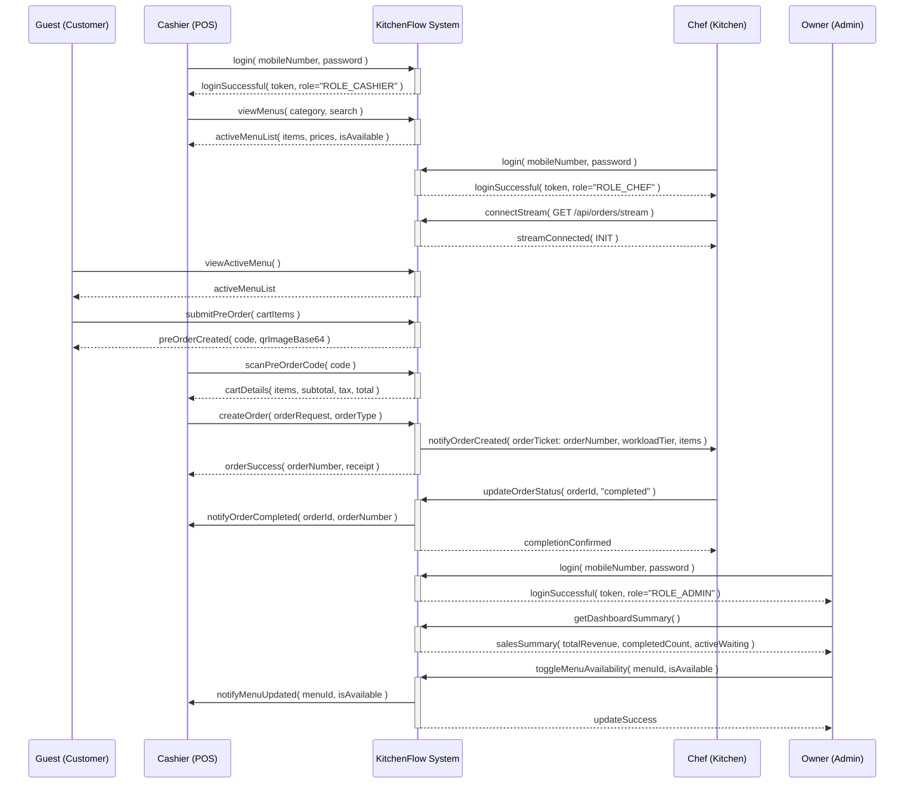
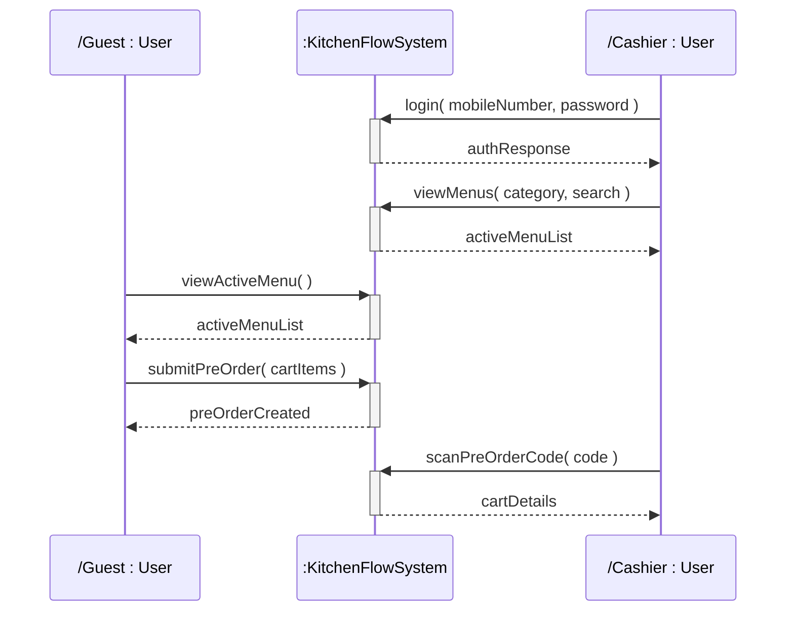
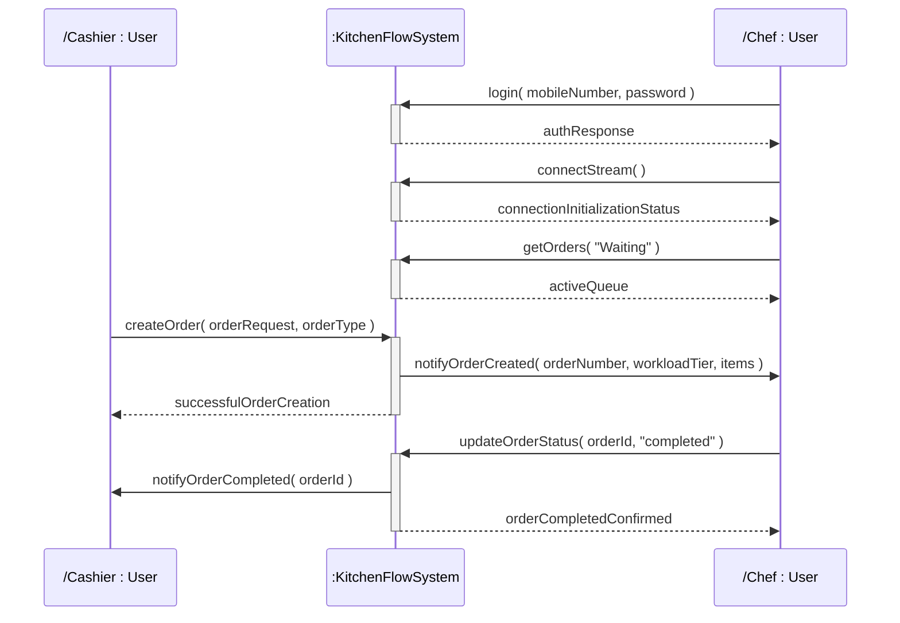
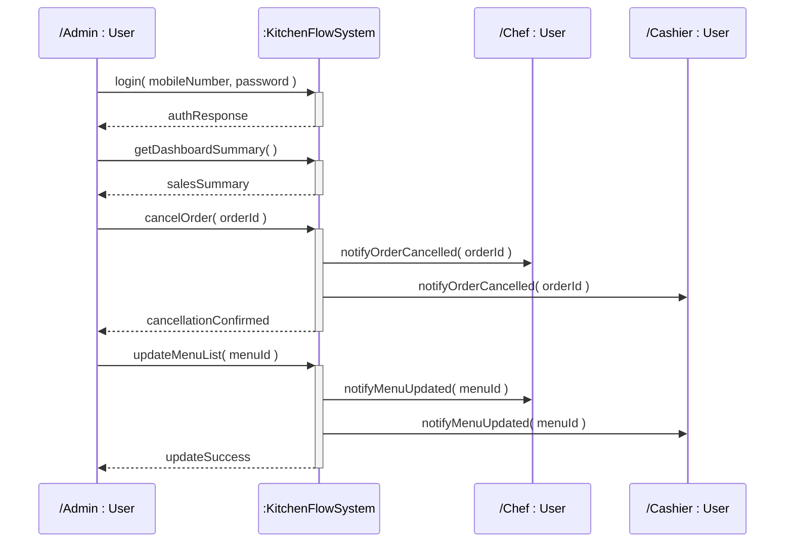

# KitchenFlow System-Level Sequence Diagrams (SSD)

This document contains the official **System-Level Sequence Diagrams (SSDs)** for KitchenFlow, structured in two sections:
1. **Section A**: The **Master Combined End-to-End System Sequence Diagram**, illustrating the complete cross-role lifecycle across the entire restaurant.
2. **Section B**: The **3 Focused Two-Sided Human Role Diagrams**, strictly following the UML standard with human actors on both sides and the central System in the middle (`Human [Left] <---> System [Center] <---> Human [Right]`).

### Architectural & UML Standards Adhered To:
- **Two Sides of Human**: In every role-pair diagram, the initiating human user is on the Left, the counterpart human user is on the Right, and `KitchenFlow System` sits in the Center as the mediator.
- **Full Authentication Included**: All staff lifelines begin with `login( mobileNumber, password )` and `loginSuccessful( token, role )`.
- **POS Menu Hydration Included**: Cashier registers load the active catalog via `viewMenus( )` upon shift setup.
- **Unidirectional Real-Time Events**: Server-Sent Events (SSE) are modeled as one-way asynchronous notifications (`System ->> Recipient`) without fake return arrows.
- **Clean Lifelines & Direct Arrows**: No interaction boundary frames (`alt`, `opt`, `rect` omitted) and no numbers on arrow connections (`autonumber` omitted).
- **Pure Rectangular Shapes**: Declared with `participant` (standard UML rectangles, no stick figures).

---

# Section A: Master Combined System Sequence Diagram (End-to-End)

Illustrates the complete operational cycle of KitchenFlow: Staff shift initialization $\rightarrow$ Guest mobile pre-order $\rightarrow$ Cashier counter scan and checkout $\rightarrow$ Automated Workload Tier & order number generation $\rightarrow$ KDS ticket dispatch $\rightarrow$ Kitchen completion and pickup broadcast $\rightarrow$ Owner governance and sales analytics.

---

# Section B: Two-Sided Human Role Diagrams

---

## 1. Customer Pre-Order Intake Pipeline (/Guest : User [Left] <---> :KitchenFlowSystem [Center] <---> /Cashier : User [Right])

Models the customer-to-cashier pre-order lifecycle: from cashier shift initialization and POS menu loading, to the guest assembling a mobile cart in line, and the cashier scanning the QR code at the counter to retrieve the validated cart.

---

## 2. Order Placement & Kitchen Fulfillment Pipeline (/Cashier : User [Left] <---> :KitchenFlowSystem [Center] <---> /Chef : User [Right])

Models the front-counter to kitchen lifecycle: from chef station login and live SSE stream connection, to cashier order checkout (with automated 5% tax, daily sequential order number, and Workload Tier calculation), real-time KDS dispatch, and chef completion broadcasting back to the cashier pickup screen.

---

## 3. Operational Governance & Broadcast Pipeline (/Admin : User [Left] <---> :KitchenFlowSystem [Center] <---> /Chef : User & /Cashier : User [Right])

Models restaurant management operations: admin authentication, sales analytics dashboard retrieval, emergency order cancellation (with real-time SSE broadcasts to both KDS and POS), and menu item update broadcasting synchronized to both Chef and Cashier screens.

